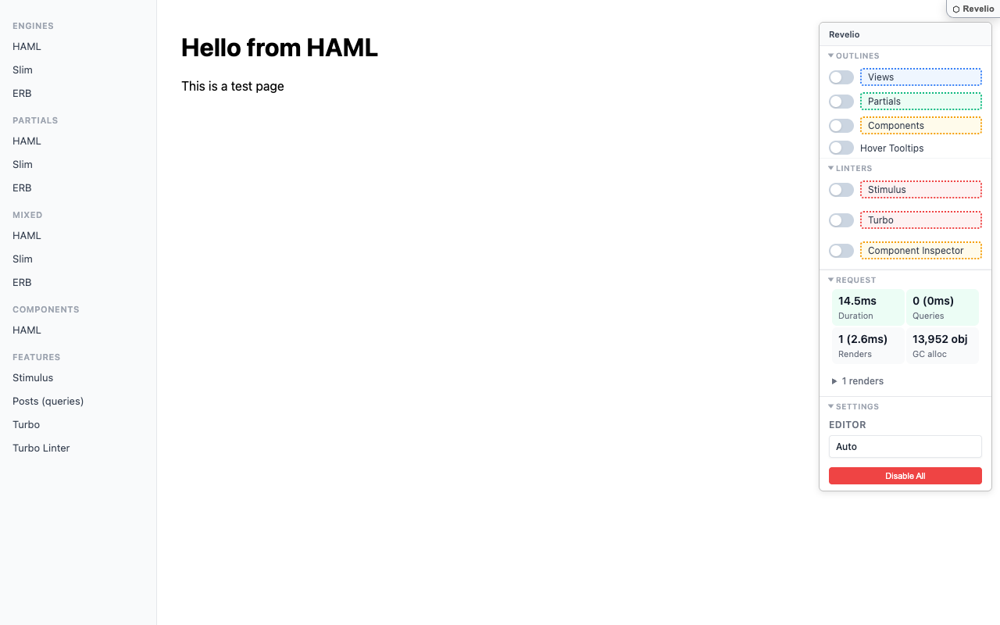
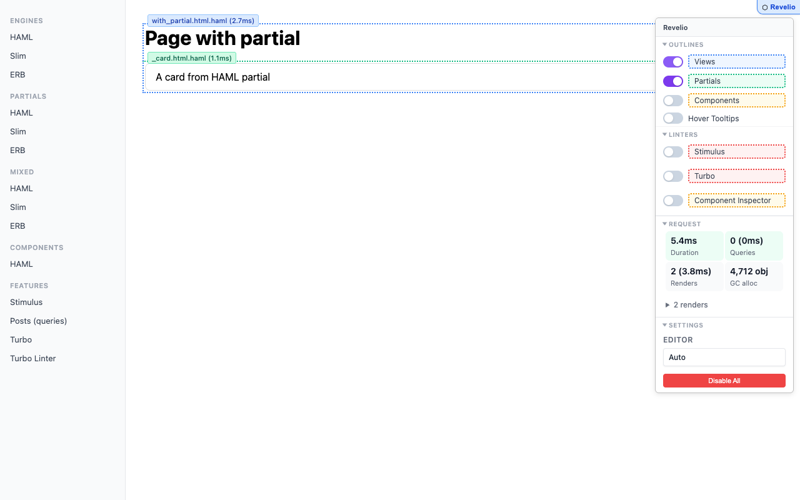
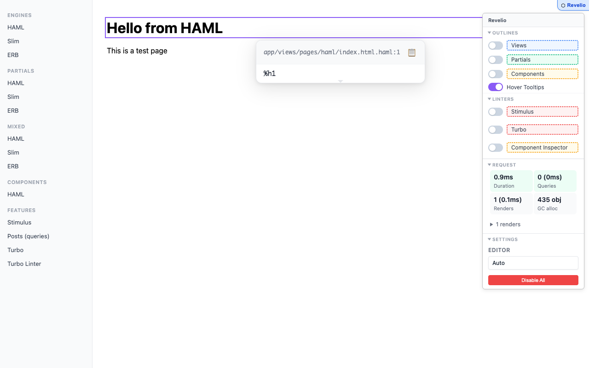
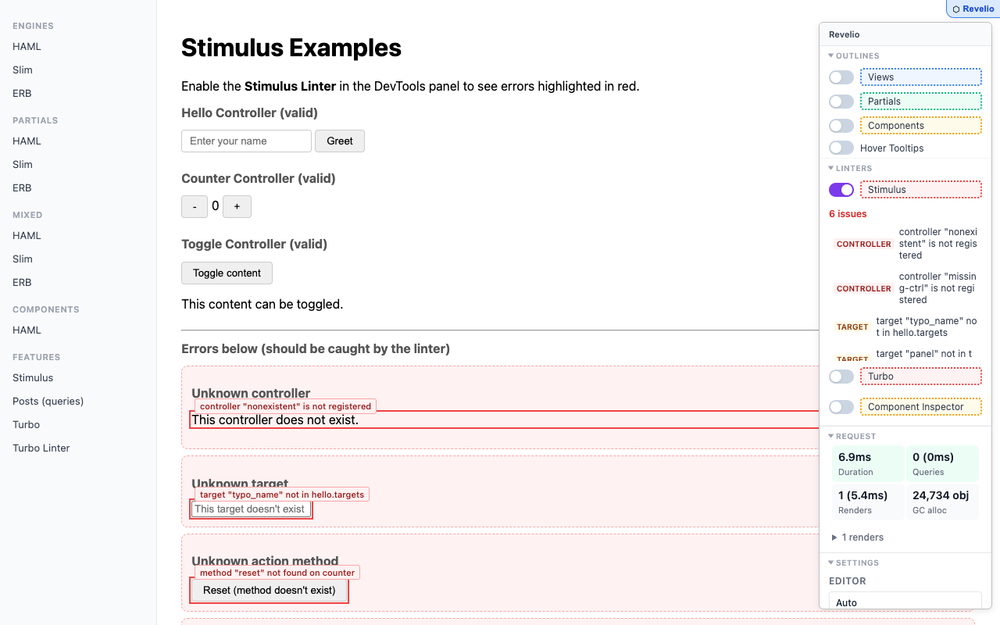
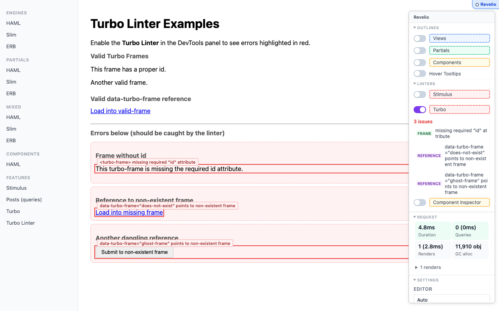
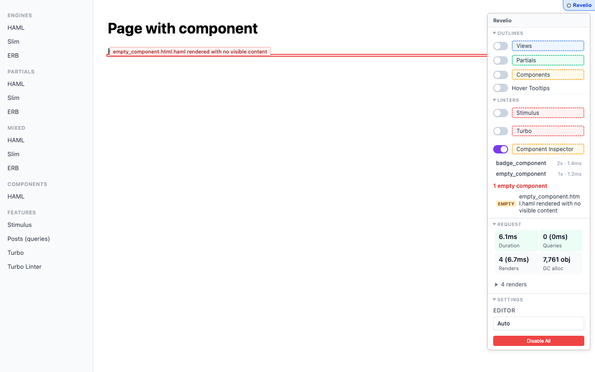
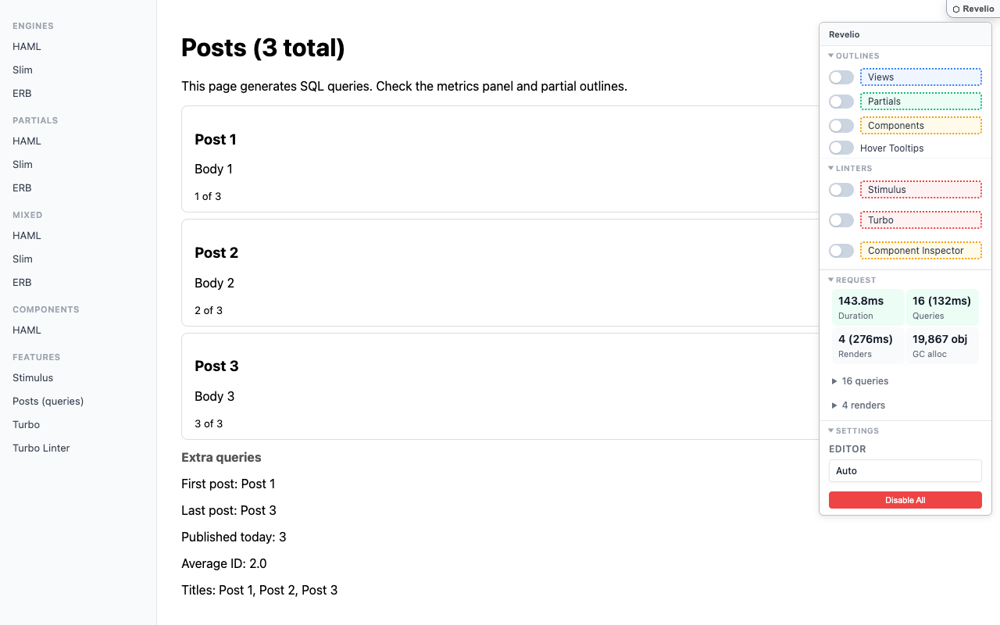

# Revelio

Debug overlays for Rails views. See template boundaries, performance metrics, and lint issues — right in the browser.



Revelio injects a floating DevTools panel into your pages during development. It works with **HAML**, **Slim**, and **ERB** templates out of the box, with no changes to your application code.

Inspired by [ReActionView](https://github.com/nicholaides/reactionview), which does something similar for ERB-only apps. If your project uses ERB exclusively, give it a look — it's excellent. Revelio extends the idea to HAML and Slim, and adds linting, metrics, and Turbo integration.

## Features

### Template Outlines

Visual boundaries around views, partials, and components. Each outline shows the template filename, render duration, query count, and how many times it was rendered.



### Hover Tooltips

Hover any element to see which template file and line rendered it. Click to open in your editor. Works with VS Code, Cursor, RubyMine, Zed, Sublime, Vim, and more.



### Stimulus Linter

Detects common Stimulus issues at runtime:
- Controllers referenced in `data-controller` that aren't registered
- Targets not defined in the controller's `static targets`
- Actions pointing to methods that don't exist on the controller



### Turbo Linter

Validates Turbo Frames:
- `<turbo-frame>` elements missing the required `id` attribute
- `data-turbo-frame` attributes pointing to non-existent frame IDs



### Turbo Stream Tracker

Logs every Turbo Stream received in the current page session — action, target, source template, and timestamp. Useful for debugging stream-heavy UIs.

### Component Inspector

For apps using ViewComponent:
- **Inventory**: lists every component rendered on the page with render count, duration, and query count
- **Empty detection**: flags components that rendered with no visible content



### Request Metrics

Server-side performance data injected per request:
- Total duration, query count and time, render count and time, GC allocations
- Expandable query and render detail lists
- Color-coded warnings when thresholds are exceeded



## Installation

Add to your Gemfile:

```ruby
gem "revelio", group: :development
```

That's it. The Railtie automatically inserts the middleware and enables the overlay in development. No configuration required.

### Manual setup

If you need more control:

```ruby
# config/initializers/revelio.rb
Revelio.configure do |config|
  config.debug_mode = true                # default: Rails.env.development?
  config.project_root = Rails.root.to_s   # for editor integration
  config.inject_overlay = true            # set false to disable

  # Performance warning thresholds
  config.duration_threshold = 200         # ms
  config.queries_threshold = 20           # count
  config.gc_objects_threshold = 100_000   # allocations
end
```

## How it works

Revelio operates at three levels:

1. **Compile time** — Template engine extensions (`prepend`) inject HTML comment markers and `data-revelio-*` attributes into compiled templates. This happens once per template compilation, not per render.

2. **Request time** — Rack middleware subscribes to `ActiveSupport::Notifications` for SQL queries, template renders, and ViewComponent renders. It collects timing, query attribution, and GC data per render, then injects the metrics JSON and the overlay script before `</body>`.

3. **Browser** — A single vanilla JS file (no dependencies) parses the comment markers, reads the metrics, and provides the floating panel UI. It uses `MutationObserver` to react to dynamic content (Turbo Frames, Streams, lazy loading).

### Turbo support

- **Turbo Drive**: panel state persists across navigations via `localStorage`. The overlay reinitializes on `turbo:load` and `turbo:render`.
- **Turbo Frames**: outlines rebuild when `turbo:frame-load` fires.
- **Turbo Streams**: comment markers are injected into stream templates before Turbo moves the content into the DOM. A stream tracker logs every received stream.

## Development

The overlay source is split into editable files under `lib/revelio/overlay/`:

```
lib/revelio/overlay/
  overlay.js    # Logic (references __REVELIO_CSS__ and __REVELIO_HTML__ placeholders)
  overlay.css   # Styles
  overlay.html  # Panel HTML template
lib/revelio/overlay.js  # Compiled output (generated, do not edit)
```

### Build

```bash
rake build:overlay    # one-shot compile
bin/dev               # start dummy app + file watcher
```

`bin/dev` runs `foreman` with two processes:
- **web**: the dummy Rails app on port 3000
- **watch**: rebuilds `overlay.js` when source files change

### Tests

```bash
rake test             # integration tests (template markers, middleware)
rake test_system      # browser tests (Capybara + Cuprite)
```

### Releasing

```bash
bin/release
```

Runs tests, builds `overlay.js`, packages the gem, tags the version, pushes to GitHub, and publishes to RubyGems. Bump the version in `lib/revelio/version.rb` and commit before running.

### Screenshots

```bash
rake screenshots      # regenerate README screenshots from the dummy app
```

## License

MIT
